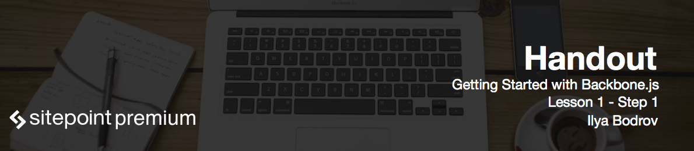

# Teacher Introduction

Hello and welcome to **Getting Started with Backbone.js** course! My name is Ilya Bodrov. During the past years I worked as Microsoft tutor, led refresher courses and currently I am working as a teacher in Russian State Technological University. Apart from that I am employed as web developer and write articles for Sitepoint.

# Course Introduction and Outline

This course is aimed at developers with at least basic knowledge of JavaScript and HTML who wish to learn Backbone.js – a JavaScript library to structure web applications.

This course consists of seven lessons:

* The first lesson is introductory. We will discuss some prerequisites and software that you should install before proceeding. Also I will give a very brief overview of the technologies that we are going to use throughout the course.
* In the second lesson we will set up project's base, include all the necessary libraries, lay foundation for file structure and eventually boot our app.
* The third lesson is fully devoted to views. We will discuss what Backbone.js views are, how to create and to work with them, what are templates and why should we use them. Handlebars.js will be used as an example of a templating system.
* The fourth lesson is all about models and collections. This will be a pretty long lesson where we will discuss different topics like data storage, binding events, adding HTML forms and much more.
* The fifth lesson is about routing in Backbone.js. You will learn what routing is and how is it implemented in Backbone. 
* In the sixth lesson we will greatly refactor our code base and introduce some common techniques to structure your code for easy maintenance. Upon finishing this lesson you will have your Backbone.js app created.
* In the seventh and the last lesson I will introduce you Backbone.js plugins that can make your life as developer easier. As an example we will boost our app with proper validations and improve user experience a bit with the help of data binding.

And now let's proceed to the next step and discuss some prerequisites to accomplish.