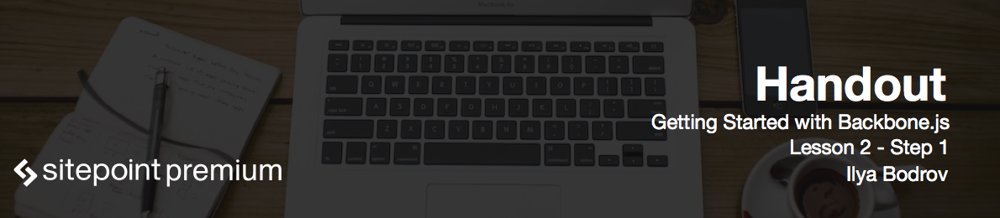

# Preparing the index.html file

Welcome to lesson 2 of Getting started with Backbone.js course. In this lesson we are going to lay the foundations of our demo app and discuss what features will the final version have. 

To start off, create a new folder at your web server's root and call it *organizer*. Inside create the *index.html* file which will be our app's main and the only page, and the *js* folder to store JavaScript files. 

Add the basic HTML structure like this:

```html
<!DOCTYPE html>
<html>
<head>
  <meta charset="utf-8">
  <title>Organizer</title>
</head>
<body>
</body>
</html>
```

# Including the libraries via CDN

Now we need to include some necessary libraries:

* Backbone.js itself
* Underscore.js which is Backbone's hard dependency
* jQuery which will be required for DOM manipulation
* Local storage adapter for Backbone.js
* Twitter Bootstrap for styling purposes (though you may use any other CSS Framework, utilize your own styling or skip this completely)

To include them we are going to be using **Content Delivery Network (CDN)**. CDN is a distributed system of servers and its goal is to serve content with high availability and perfomance. Hence servers are located in every part of the world, users are able to download content from the closest node. Moreover, browser is capable of downloading multiple resources from different locations in parallel so this speeds up page loading time.

We are going to employ [CDN JS](https://cdnjs.com) powered by CloudFlare that hosts numerous of popular and not-so-popular libraries.

Enter "backbone" in the search field. You may either choose **full** or **minified** version of the library. For production environment it is much better to use the latter as it has smaller size. As long as we are only starting our BackboneJS journey, it would be better to be able to look at the source code, so use full version instead.

```html
<script src="https://cdnjs.cloudflare.com/ajax/libs/backbone.js/1.1.2/backbone.js"></script>
```

Repeat the same steps for jQuery, just make sure that jQuery is placed before Backbone:

```html
<script src="https://cdnjs.cloudflare.com/ajax/libs/jquery/2.1.3/jquery.js"></script>
```

Please note that jQuery 2.x does not support older version of Internet Explorer (specifically 6, 7 and 8). If you have to support them, choose version 1.x instead. 

Now Underscore:

```html
<script src="https://cdnjs.cloudflare.com/ajax/libs/underscore.js/1.8.3/underscore.js"></script>
```

Please note that you have to place it before Backbone as it the required dependency and must be loaded before Backbone.

Lastly Local Storage adapter:

```html
<script src="https://cdnjs.cloudflare.com/ajax/libs/backbone-localstorage.js/1.1.16/backbone.localStorage.js"></script>
```

This library has to be put after Backbone as it relies on it.

# Including Bootstrap

Lastly include Bootstrap to apply some styling. You will see quite a lot of available files. "Theme" is an optional CSS file with theming. Use it if you wish, but don't forget that it relies on Bootstrap's main file to work which are *bootstrap.css* and *bootstrap.min.css*. I am going to use the minified version:

```html
<link rel="stylesheet" href="https://cdnjs.cloudflare.com/ajax/libs/twitter-bootstrap/3.3.4/css/bootstrap.min.css">
```

Let me point out that Bootstrap can be further customized on the Customize page of its official website. You may check which components to include in the resulting file and actually that is a very good idea for production environment as you don't want users to download something that is not used anywhere on the page.