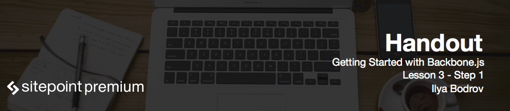

# Creating a Backbone.js view

Welcome to lesson 3 of Getting started with Backbone.js course! In this lesson we are going to discuss Backbone.js **views**, **events** and **Handlebars.js templating engine**.

Backbone.js view is responsible for rendering HTML to the DOM. It contains logic behind presentation of data and typically relies on JavaScript templating to render the actual markup. Views also react to user's actions and work with events. If you came from Rails or ASP.NET world, you might be surprised that views in BackboneJS carries out pretty many tasks. In fact, they perform some of controller's responsibilities as we are going to see later.

Before creating our first view let's create a global JavaScript object to contain all our app's code, therefore we namespace it properly. That is a good habit and I really recommend sticking to it. Open up *app.js* file and add the following:

```js
Organizer = {
  initialize: function() {
    
  }
};
```

The `var` keyword can be omitted as we are in the global scope and basically the `Organizer` will become a global variable in any case.

`initialize` will be the main function to boot up the app. The app should be booted when the DOM has finished loading and for that we can utilize a simple jQuery code:

```js
$(document).ready(function() {
  Organizer.initialize();
});
```

Now let's add a new element to our page and make a BackboneJS view. This view will be responsible for rendering a list of our events:

```html
<div id="app" class="container">
  <div id="events-list"></div>
</div>
```

Inside the *views* folder create an *events.js* file and include it in the page. This file will contain all the views related to the events. Hook it up to your project:

```html
<script src="js/views/events.js"></script>
```

Don't forget that this line should be put after the *app.js* because first of all we have to instantiate the global object.

Inside place the following code:

```js
Organizer.EventsListView = Backbone.View.extend({
  render: function() {
    $(this.el).html('<h2>Our events:</h2>')
  },
  el: '#events-list'
});
```

As you see I am attaching this view to my `Organizer` global object. Next we are using `extend`. JavaScript has no classes and therefore does not provide typical inheritance mechanism, so this extending mimics inheritance, however those are not the same. `extend` is the Underscore's method that copies all the properties of the source object to the destination object. After extending we can add our own functionality to the resulting object.

By convention each view has to have the `render` function, though you may call it anything else. Typically this function makes manipulations to the DOM.

Where is content being rendered to? Every view has an element associated with it and this element is defined as `el`. For now you should remember that `this.el` refers to the DOM element associated with the view. By using the `$` we turn this element to a wrapped jQuery object.

```js
$(this.el)
```

can be re-written as

```js
this.$el
```

which also provides some caching.

The property `el` contains element's ID in this case (as you recall, we've created `div#events-list` some time ago). Backbone can also create this element for you if it is not present on the page. To do that, instead of `el` provide any combination of the following properties:

* `tagName`
* `id`
* `className`

If `tagName` is not provided, `div` is used by default.

Navigate to the *organizer/index.html*. The page will be empty because we have not called our `render` function anywhere. You may do it from the console for now:

```
view = new Organizer.EventsListView();
view.render();
```

We've just created our first Backbone view! 

# Difference between el with and without and dollar sign

Add two more lines of code to the `render` function to demonstrate difference between `el` with and without `$`:

```js
console.log(this.el);
console.log(this.$el);
```

The first one is a good old HTML. The second one contains jQuery wrapped set which is basically an object with some special properties and methods.