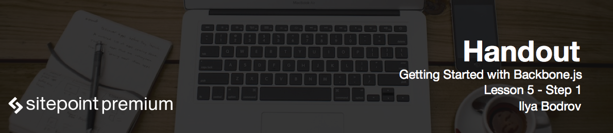

# Introduction to Backbone.js router

Up to this point we had a very simple app with a form and a list of items beneath it. However, what if I want to create a separate page to show a more detailed information about an event?

In BackboneJS we use **routers** to connect URLs to different parts of your application. Even if in reality our app is presented by a single HTML file, users will still be able to bookmark these URLs. To put it simple router defines what happens when a user visits a specific path. You may think of it as of book's index: you just instruct where to find various parts of your application.

Router observes changes in the URL and reacts to these changes by running the corresponding action.
Until recently we had to use hash symbols (`#`) however with emerging of the **History API**, standard URLs might be used. History API uses a special push state mechanism that allows us to rewrite URL without actually reloading the page. Older browsers do not support History API, however Backbone handles fallback to hash fragments for them.

As Backbone does not have a controller, router carries out some of its responsibilities as we will see next. However I want to point out that before you implement a router stop for a second and think if you really need it, because it is one of trickiest parts of Backbone and might present some problems.