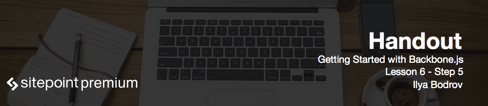

# Introducing application layout

We want to get rid of everything inside the `#app` block and dynamically add elements there instead. 

Let's introduce yet another layout for the whole application. The concept behind this layout is actually really simple: it is a view that is attached to the top-level element (`#app` in our case) that empties an element on each subsequent render and adds new contents there.

# An example of app layout

```js
Organizer.BaseAppLayout = Backbone.View.extend({
  render: function(view) {
    this.$el.empty();
    view.render();
    this.$el.append(view.el);
  }
});
```

This is a really simple view with only 3 lines of code inside the `render` function. We empty the element, we render the view, we append the contents of the view to the element.

Now instantiate this view inside the *app.js*:

```js
Organizer.appLayout = new Organizer.BaseAppLayout({
  el: '#app'
});
```

Here we just hook this view to the `#app` element.

Where do we render this view? Obviously, in the route helpers, because we need to react to user's actions.

```js
index: function() {
  var eventsLayout = new Organizer.EventsLayoutView({
    collection: Organizer.events
  });
  Organizer.appLayout.render(eventsLayout);

  Organizer.events.fetch();
},
```

We just instantiate the layout view and pass it to the application layout's render function. We don't need `el` property anymore, because now application layout controls where to render the view.

Do the same for the show action handler:

```js
showEvent: function(id) {
  Organizer.events.fetch();

  var showLayout = new Organizer.ShowEventLayoutView({
    model: Organizer.events.localStorage.find({id: id})
  });

  Organizer.appLayout.render(showLayout);
}
```

Note that `EventsLayoutView` and `ShowEventLayoutView` should not be rendered automatically anymore, so remove `initialize` function completely.

Lastly we can remove those container from the `#app`:

```html
<div id="index"></div>

<div id="show"></div>
```

With this nested views structure you can easily add as many views and layouts as you wish – the process will be the same!