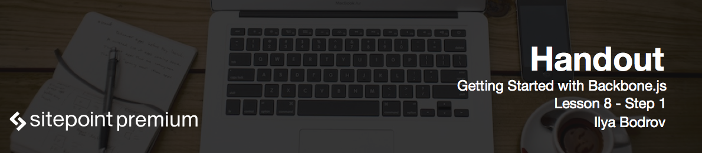

# Conclusion

Congratulations! You've made it to the end of this course and created your first Backbone.js application. I hope it was useful for you and now you feel confident to start using Backbone into your real projects. Feel free to utilize parts of the code and concepts from the demo app.

I would really love to receive feedback from this course, so feel free to drop me an e-mail. Also if you have any questions on this course contact me directly or use commenting system on Learnable – I will answer as soon as possible.

So I want to thank you for staying with me till the end. Happy coding and see you soon!