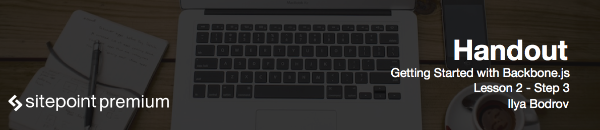

# Talking about the app

Before we start discussing BackboneJS let's spend some minutes and talk about the app that we are going to build.

This app is called Organizer and it lists all your planned events. It will have a form to create a new event. Each event will have a title and a description.

User will not be able to submit an empty form - if he does, error messages will appear. However as soon as he enters some valid data, error messages should be gone.

After the event is added, it should be placed to the end of the list, so this means that these items should be sorted.

Any event may be removed using the Remove button.

Clicking on event's name opens another page with more detailed information.

Feel free to use parts of the code from this app in your other projects. You can download lesson's code by clicking Download button beneath the video or visit GitHub to browse source code there. Each lesson and step has its own branch so you can easily track what has changed between the lessons.