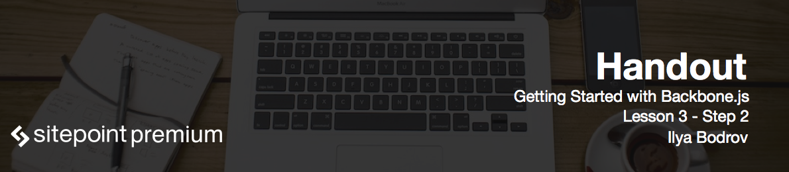

# Drafting events list view

In this step we will draft the events list view.

We can't render our view via console every time, so let's add the corresponding code to the `initialize` function:

```js
var eventsList = new Organizer.EventsListView();
eventsList.render();
```

Return to the *events.js* file and let's render a list of events. Currently they will be fetched from an array. It is a good habit to separate list views and individual item views – later we will see why. So create a new view called `EventView` by using the same principle we've seen earlier:

```js
Organizer.EventView = Backbone.View.extend({

});
```

When talking about lists and items it is natural to use unordered lists. So for a single event write

```js
Organizer.EventView = Backbone.View.extend({
  tagName: 'li'
});
```

This way Backbone will create this tag for us.

For events list view replace the `el` property with

```js
tagName: 'ul'
```

Remove 

```js
$(this.el).html('<h2>Our events:</h2>')
```

from `render` function and delete 

```html
<div id="events-list"></div>
```

from *index.html*.

As long as we have not implemented any storage for our events yet, let's just create a simple array pretending to be the list of events.

```js
Organizer.EventsListView = Backbone.View.extend({
  tagName: 'ul',
  render: function() {
    var events = [
      {title: 'go to work'},
      {title: 'meet with friends'},
      {title: 'visit grandma'}
    ];
  }
});
```

Now we just have to iterate over this array and render a single event on each iteration. Here is the cycle:

```js
_.each(events, function(event) {
  
});
```

Underscore's `each` method is used here. `event` variable contains the single event. We can pass this event to our event view easily:

```js
_.each(events, function(event) {
  var eventView = new Organizer.EventView({model: event});
  this.$el.append(eventView.render().el);
});
```

Each view may have a **model** associated with it. We are going to work with models in the further lessons, but for now think of it as of some data.

`this.$el.append(eventView.render().el);` means that we are rendering `eventView` that was instantiated on the previous line, then taking the resulting element and appending it to our current element which is `ul`.

Now code the `render` function for the `eventView`:

```js
render: function() {
  this.$el.html(this.model.title);
  return this;
}
```

To gain access to our data we use `this.model`. Providing `return this` is always a good idea because this way you can chain views.

Now we need to display the unordered list somehow. The easiest way is to simply call jQuery's `html` method directly and render the list into the `#app`:

```js
$('#app').html(this.el);
```

In the following steps we are going to refactor this code.

Now open the console and reload the page. You will see an error "this.$el is undefined". How could that be? The easiest way to debug such error is by using `console.log` inside the `each` cycle:

```
console.log(this);
```

It appears that `this` points to the `window`, not the view. When we enter the `each` cycle, our scope changes and `this` no longer points to the view. To fix this, create another variable called `that` and store view there.

```js
var that = this;
var events = [
  {title: 'go to work'},
  {title: 'meet with friends'},
  {title: 'visit grandma'}
];
_.each(events, function(event) {
  var eventView = new Organizer.EventView({model: event});
  console.log(this);
  that.$el.append(eventView.render().el);
});
$('#app').html(this.el);
return this;
```

# Optimizing the code

There is a small optimization that we can apply to our code. Maybe you know that using jQuery's `append` method in a loop is not quite optimal. Instead it is better to form an array with all the necessary elements and then place it into the element at once:

```js
var events_elements = [];
  _.each(events, function(event) {
    var eventView = new Organizer.EventView({model: event});
    events_elements.push(eventView.render().el);
  });
this.$el.html(events_elements);
```

This way we get rid of `that` variable completely, but still always keep this scoping issue in mind.