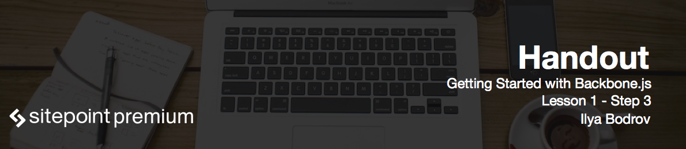

# Introduction to Backbone.js

**BackboneJS** a JavaScript library that helps you organize your code. This allows you to craft much more maintainable apps.

During the past years **single page web application (SPA)** has become really popular. Single page application is a web application that loads into your browser and react to user actions without constant page reloads – this way web apps behave more like a desktop apps. Decreased latency causes a positive impact on user experience.

Single page applications rely heavily on JavaScript and that's why this language has become very popular. Single page apps may become really complex and therefore we need a way to organize our code. Organized code means faster refactoring and easier testing. And this means that you in turn spend less time working with your app.

Backbone employs a variation of **MVC** software architectural pattern which actually separates concerns in an application into the following pieces:

* **Model** works with with data of some kind.
* **View** typically presents data to the user (in many cases it involves markup or templates).
* **Controller** acts like a "glue" to react to user input and work with models.

BackboneJS (as well as some JS frameworks), however, does not present controllers as such, so many developers refer to this pattern as **M-V-star**. Backbone provides the following components:

* **View** that we will discuss in the 3rd lesson. You will see that the view in Backbone.js takes some controller's responsibilities.
* **Model** and **collection**. We will discuss both of these in the 4th lesson.
* **Router** that we will work with in the lesson 5. Router also carries out some controller's responsibilities.

# Some JS frameworks

BackboneJS is not a framework, but rather a lightweight library. Still there are some powerful JS frameworks that you may have heard of, like **AngularJS** or **EmberJS**. These frameworks are pretty opinionated which means that you have to spend some time understanding the philosophy behind the solution.

BackboneJS is simpler and a bit more low-level – that is, it relies on programmer to do more things on his own. However, this means that you have more freedom and flexibility – craft the  application as you see fit, Backbone only provides you the necessary tools. Another cool thing about Backbone is its community that has produced lots of tutorials, demos and even additional plugins to extend Backbone further that we will discuss throughout the course as well.

To see how many JavaScript frameworks have emerged during past years, you may navigate to [http://todomvc.com/](http://todomvc.com/) where the same simple Todo app is implemented.

This does not mean that you have to use BackboneJS or any other JS framework for every project you build. If you have only a small amount of a trivial JS code, employing Backbone would clearly be an overkill.